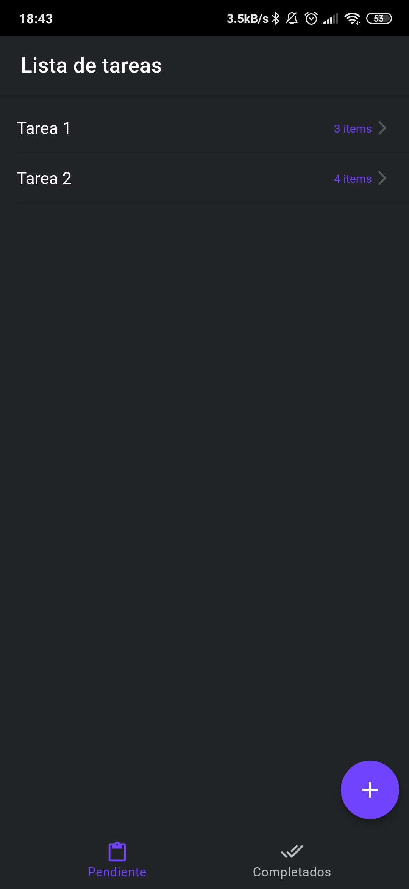
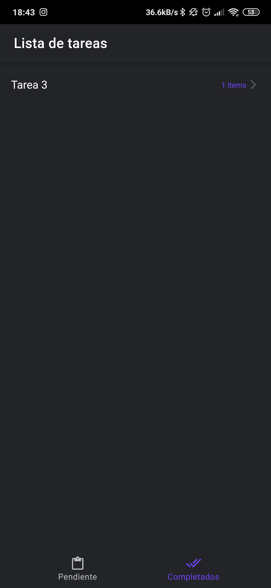
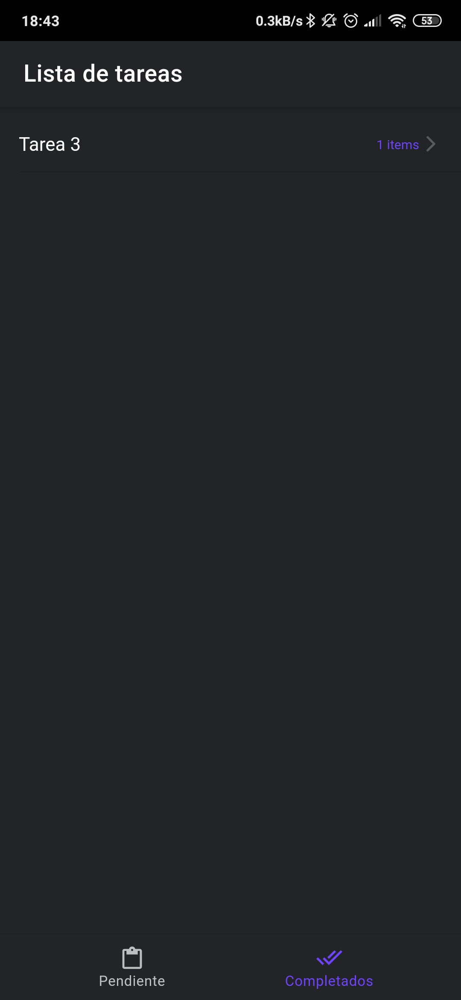
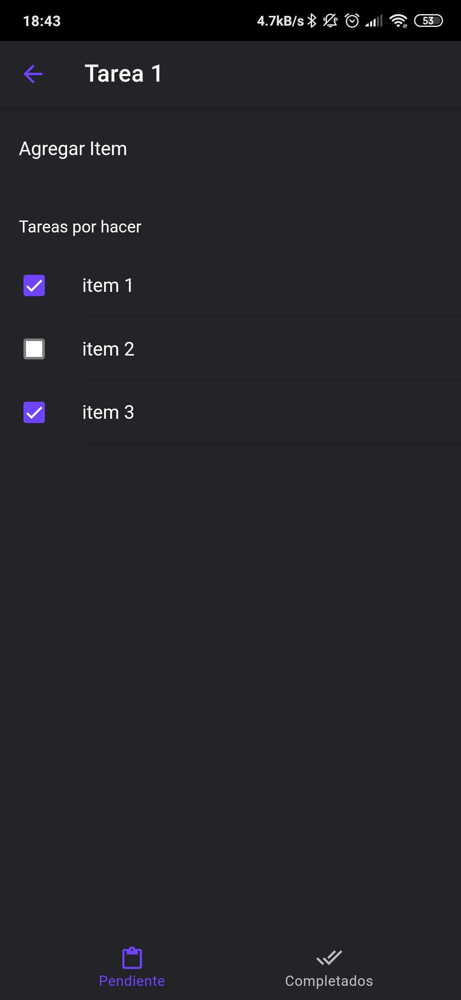

# Lista de tareas - Ionic Angular

Aplicación desarrollada en Ionic Angular, con el fin de disponer de un control de tareas por hacer. Cada tarea posee un checklist, el cual una vez completado, la tarea se da por completada y pasa a la pestaña "Terminadas", utilizando el Modulo Storage de Ionic para la permanencia de los datos.

<p float="left">
    
    
    
    
</p>

## Instalación

Clonar el repositorio e instalar Node 10.9 y Ionic Angular.

Se recomienda instalar NVM siguiendo los pasos del siguiente [link](https://github.com/nvm-sh/nvm).

```bash
nvm install 10.9
nvm use 10.9
npm install -g ionic cordova
```

## Uso

```bash
cd lista-de-tareas-ionic
nvm use
npm install
ionic serve
```

## Licencia
[MIT](https://choosealicense.com/licenses/mit/)